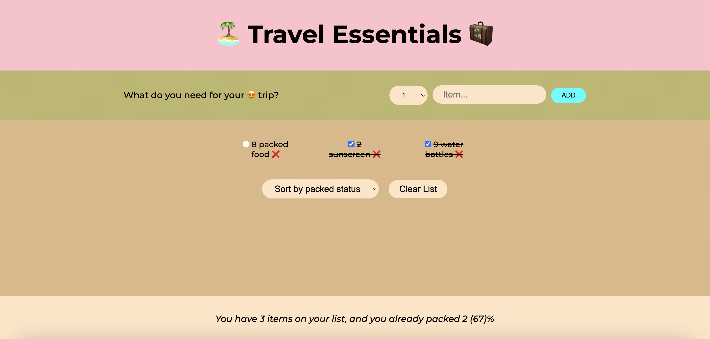

# Travel Essentials
## Project Description
This is a website where users can add the items along with the quantity for the trip via a form and these will be rendered in the UI.They can sort the displayed items and also clear all the items array and render null on the screen.The total number of items added, number of items packed and the packed percentage will also be shown at the bottom of the UI.
I used React to layout the components and CSS to style these.I used React in stead of JS because of reusability and it is easier to structure the layout.
I faced some challenges in responsive design and vertical layout.
## How to Install and Run the Project
You can clone the project using git ```git clone <repository-url>
cd <project-directory>```
Install latest version of Node.js and NPM 
Use create-react-app or Vite to scaffold a new React app
```npx create-react-app my-app cd my-app npm start```
```npm create vite@latest my-app --template react cd my-app npm install```
##How to Use the Project
Just do it
##Credits
jonas schmedtmann, for his wonderful javaScript and React courses in Udemy.
##License
MIT License


